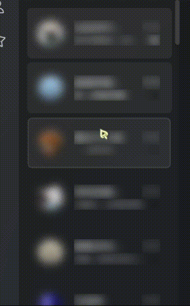

# Chat_list_animation
基于[LiteLoaderQQNT框架](https://github.com/LiteLoaderQQNT/LiteLoaderQQNT)，[transitio插件](https://github.com/PRO-2684/transitio)和[Scriptio插件](https://github.com/PRO-2684/Scriptio)

>[!NOTE]
>写的简陋还请见谅
>未来可能会做成单独的插件

>[!IMPORTANT]
>分为CSS部分和JavaScrip部分
>需要配合使用

## [CSS部分](https://github.com/naahi-i/LiteLoaderQQNT--Transitio--Chat_list_animation/blob/main/Chat_list_animation.css)
在transitio插件中使用
直接导入即可

## [JavaScrip部分](https://github.com/naahi-i/LiteLoaderQQNT--Transitio--Chat_list_animation/blob/main/Chat_list_animation(JavaScrip).js)
在Scriptio插件中使用
直接导入即可
> [!WARNING]
> js部分对会话列表的元素中临时添加了 `data-add-animation='true'` 属性
> 可能与其他脚本冲突

## 🪄效果

